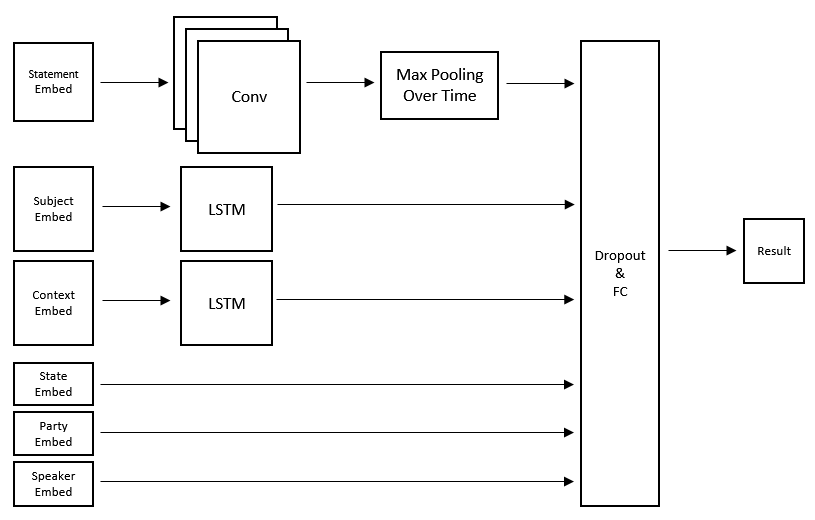

# A Simple Fake News Detection Algorithm

This is an fake news detection for fake news dataset "Liar, Liar Pants on Fire" (Wang, 2017) by [Dr. William Wang](http://www.cs.ucsb.edu/~william/) from UCSB. Dataset could be found [here](http://www.cs.ucsb.edu/~william/data/liar_dataset.zip).

### Dataset Description

All data are labeled as six different categories: "pants-on-fire", "false", "barely-true", "half-true", "mostly-true", "true". 

Each data sample has eight attributes: statement, subject, speaker, speaker position, state, party, context.

### Method

For statement text, we use similar Convolutional Neural Network in (Kim, 2014).

For subject text, speaker position text and context text, we pass data through seperate Long-Short Term Memory network and regard hidden state as feature vectors.

For speaker, state and party columns, we use word embedding directly.

Concatenate all feature vectors above and pass them all through a fully connected layer followed by LogSoftmax loss.



### How to Use

[TODO] Support argument parser.

Currently, all hyperparameters can be set only inside Python files (mainly in train.py).

Execute:

```
python run.py
```

### Result

After training 5 epochs without fine-tuning, this algorithm could achieve 22.44% accuracy.

There must be some improvement methods. If you have any idea, feel free to contact me.

### Reference

1. Wang, W. Y. (2017). "Liar, Liar Pants on Fire": A New Benchmark Dataset for Fake News Detection. *ACL 2017*.
2. Kim, Y. (2014). Convolutional Neural Networks for Sentence Classification. *EMNLP 2014*.